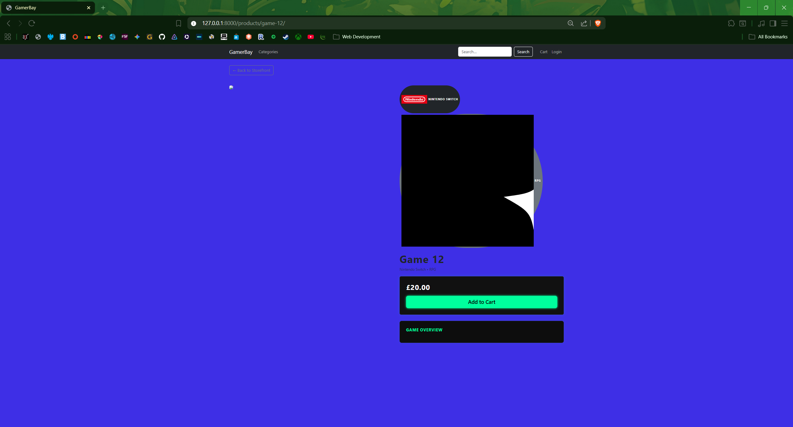
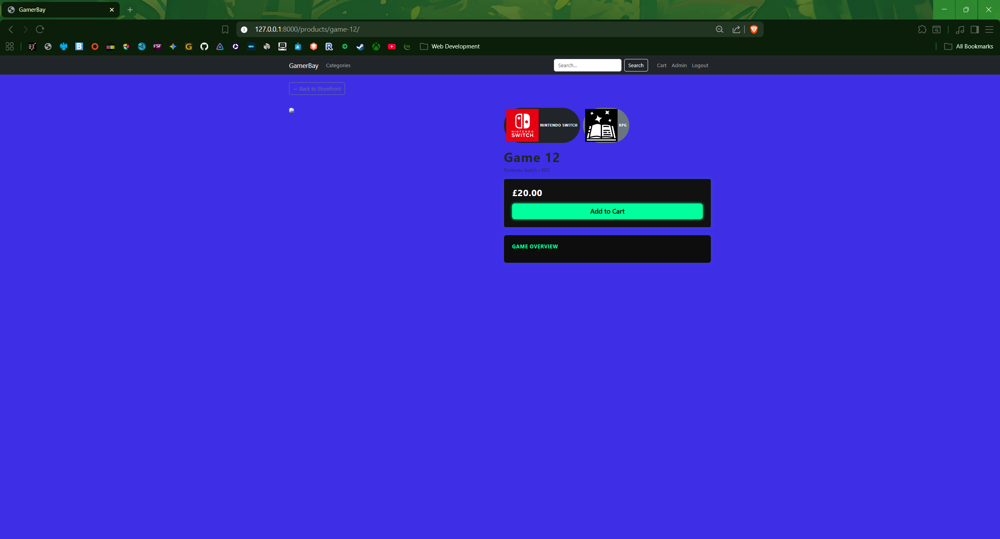
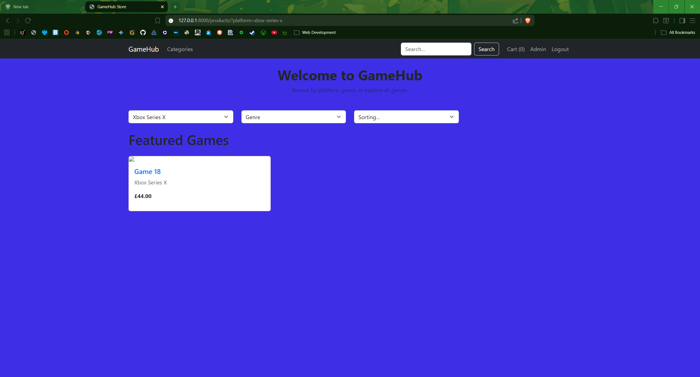
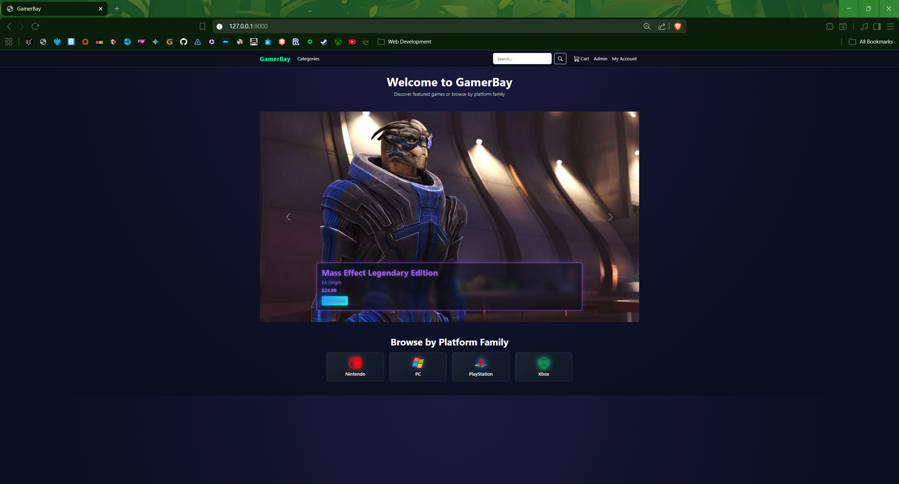
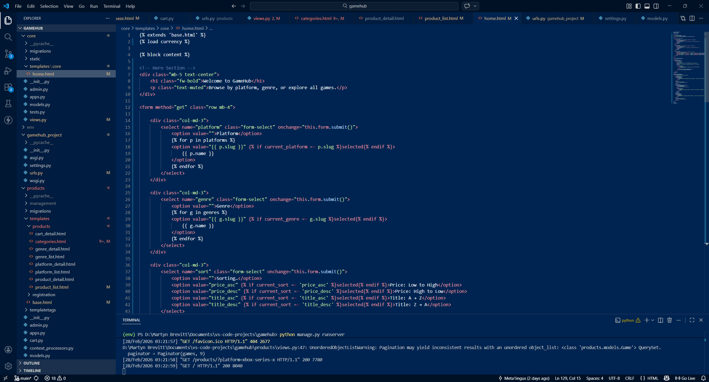
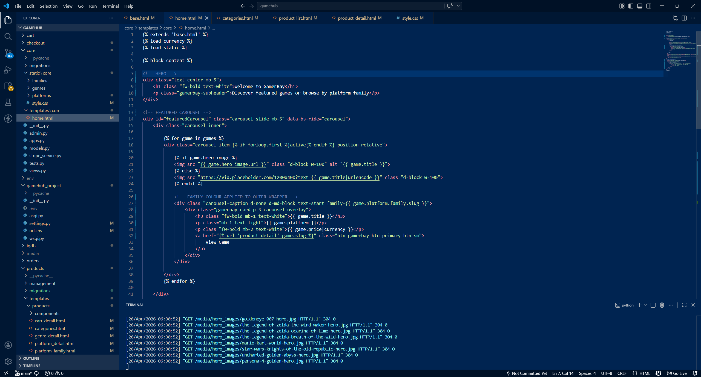
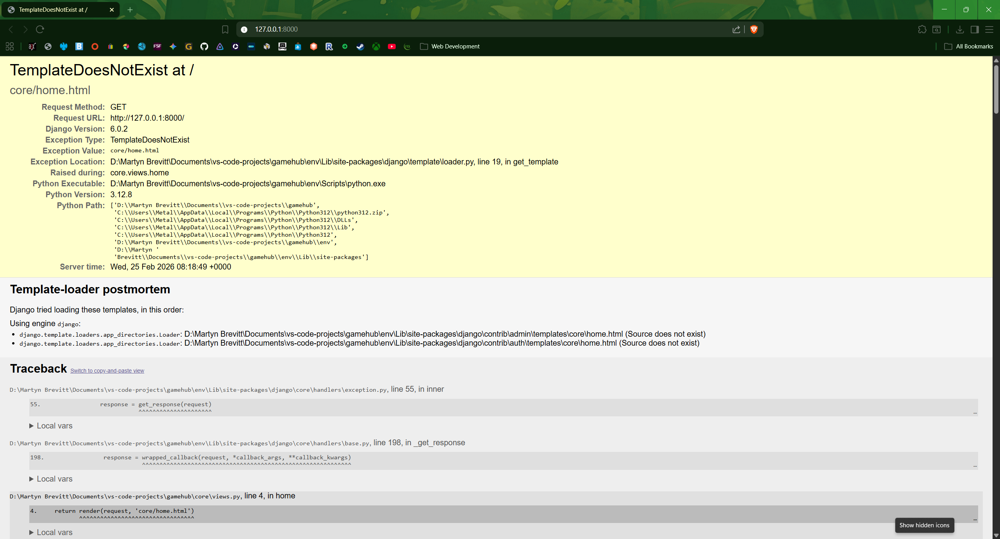
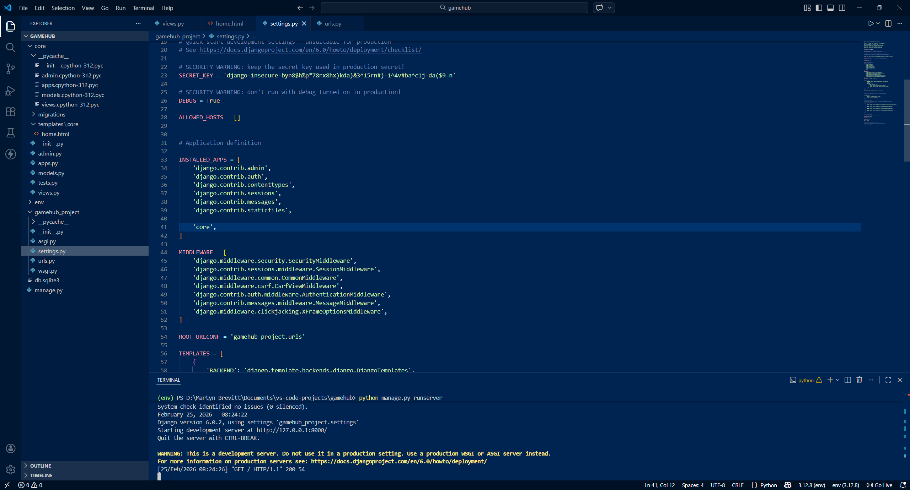
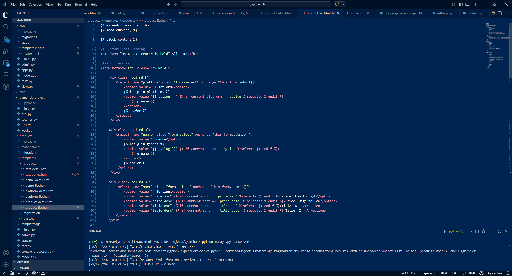

# GamerBay - A Neon‑Styled Game Storefront

GamerBay is a full‑stack Django web application that allows users to browse, purchase, and manage video game products across multiple platforms. It features a custom neon‑themed UI, platform family grouping, dynamic hero‑image product pages, a shopping cart system, and secure Stripe‑powered checkout.

The project is built using:

- **Django (Python)** for backend logic and data handling  
- **A relational database** (MySQL/PostgreSQL recommended)  
- **HTML, CSS, and JavaScript** for the frontend  
- **Stripe Checkout** for payment processing  
- **Bootstrap** for layout structure and responsive design  

GamerBay provides a clean, modern shopping experience with a strong visual identity, intuitive navigation, and a fully functional e‑commerce flow.

---

## Tech Stack

A breakdown of the technologies, tools, and services used to build and deploy GamerBay.

| Layer              | Technologies & Tools                                                                 |
|--------------------|---------------------------------------------------------------------------------------|
| **Backend**        | Python 3, Django, Django ORM, Custom IGDB Importer                                    |
| **Database**       | SQLite (development & deployment)                                    |
| **Frontend**       | HTML5, CSS3, Bootstrap 5, Custom Neon Styling, JavaScript (minimal, UX‑focused)       |
| **Payments**       | Stripe Checkout, Stripe Webhooks (checkout.session.completed), Secure signing secret validation, Server‑side order creation and post‑payment processing                           |
| **Deployment**     | Raspberry Pi Server, Gunicorn, Cloudflare Tunnel (HTTPS), Environment Variables       |
| **Static Handling**| Django `collectstatic`, Cloudflare CDN caching                                        |
| **Version Control**| Git, GitHub                                                                            |
| **Development**    | VS Code, Browser DevTools (Chrome, Firefox, iOS via responsive emulation)             |
| **Admin Tools**    | Django Admin (customised models, PlatformFamily system, product management)           |
| **Security**       | Django Security Middleware, CSRF protection, XSS protection, Secure password hashing  |

---

## Table of Contents

- [GamerBay — A Neon‑Styled Game Storefront](#gamerbay--a-neonstyled-game-storefront)
- [Tech Stack](#️tech-stack)
- [Features](#features)
- [Core Functionality](#core-functionality)
- [UX & Design](#ux--design)
- [Data Model](#data-model)
- [App Structure](#app-structure)
- [Stripe Payment Flow](#stripe-payment-flow)
- [Deployment](#deployment)
- [Production Settings](#production-settings)
- [Security](#security)
- [Screenshots & Error Fixes](#screenshots--error-fixes)
- [Testing](#testing)
- [Future Enhancements](#future-enhancements)
- [Changelog](#changelog)
- [Credits & Acknowledgements](#credits--acknowledgements)
- [Disclaimer](#disclaimer)

---

## Features

### Core Functionality

- **Browse Games**  
  Users can explore a catalogue of games filtered by platform, genre, or category.

- **Product Detail Pages**  
  Each game has a dedicated page featuring:
  - Full‑width hero backdrop
  - Glass‑panel information layout
  - Platform and genre badges
  - Pricing and purchase options
  - Automatic “Out of Stock” messaging when a game cannot be purchased
  - **Free‑to‑Play Storefront Links**  
    Games marked as free‑to‑play include a direct link to their official external storefront  
    (e.g., Steam, Epic Games Store, PlayStation Store).  
    Instead of a price or purchase button, users see a **“Download Free”** action that redirects them to the official source.
  - **Secure Stripe Checkout** for single‑item and multi‑item purchases  
  - **Automatic cart clearing** after successful payment  
  - **Webhook‑driven order confirmation**  
  - **Stock reduction** for physical items after purchase  

- **Shopping Cart System**  
  Users can add items to a cart, update quantities, and remove items.  
  Logged‑in users have their cart persisted across sessions.

- **Stripe Checkout (Test Mode)**  
  Secure payment flow using Stripe Checkout.  
  Successful payments create an order and return a confirmation message.

- **User Accounts**  
  Users can register, log in, and manage their profile.  
  Authentication is required for checkout and cart persistence.

- **Admin Management**  
  Admin users can manage:
  - Games
  - Platforms
  - Genres
  - Orders
  - Platform families
  - Stock

---

### UI & Visual Features

- **Neon‑Themed Global Design**  
  A consistent neon aesthetic across all pages, using custom CSS variables.

- **Platform Family Colour System**  
  Each platform family (PlayStation, Xbox, Nintendo, PC) has its own glow and accent colour.

- **Hero Image Fallback Gradient**  
  If a game has no hero image, a dynamic neon gradient is used instead.

- **Rounded SVG Icon Tokens**  
  Platform and genre icons are displayed as circular tokens inside badges.

- **Responsive Layout**  
  Fully responsive design using Bootstrap grid and custom styling.

---

### Additional Enhancements

- **Glassmorphism Panels**  
  Product detail pages use blurred, semi‑transparent panels for a modern UI feel.

- **Hover Effects & Animations**  
  Cards, buttons, and icons include subtle neon glows and motion effects.

- **Structured Navigation**  
  A fixed navbar provides quick access to categories, cart, and user account.

---

## UX & Design

GamerBay is designed with a strong focus on clarity, visual identity, and ease of use.  
The interface blends a modern neon aesthetic with clean layout structure to create a distinctive, immersive shopping experience.

### Design Goals

- **Clear Navigation**  
  Users can easily move between categories, product pages, cart, and account areas.

- **Strong Visual Hierarchy**  
  Important elements such as game titles, pricing, and purchase actions are visually prominent.

- **Consistent Neon Aesthetic**  
  The entire site uses a unified neon theme powered by CSS variables, platform family colours, and subtle glow effects.

- **Readable and Accessible Layout**  
  Typography, spacing, and contrast are chosen to ensure readability across devices.

### Key UI Components

- **Neon Cards**  
  Product listings use glowing neon cards with hover animations to highlight interactivity.

- **Glassmorphism Panels**  
  Product detail pages feature blurred, semi‑transparent panels that create depth and focus.

- **Platform Family Colour System**  
  Each platform family (PlayStation, Xbox, Nintendo, PC) has its own accent colour and glow, applied consistently across badges, icons, and hover states.

- **Hero Image System**  
  Product pages display a full‑width hero backdrop.  
  If a game has no hero image, a dynamic neon gradient fallback is used.

- **Rounded SVG Icon Tokens**  
  Platform and genre icons are displayed inside circular tokens for a clean, modern look.

- **Responsive Layout**  
  The site adapts smoothly to mobile, tablet, and desktop using Bootstrap’s grid and custom CSS.

---

## Data Model

GamerBay uses a relational database schema designed around platforms, genres, products, and orders.  
The structure supports clear relationships between entities and allows the site to scale as more games and platforms are added.

### Core Models

- **PlatformFamily**  
  Represents a high‑level console family (e.g., PlayStation, Xbox, Nintendo, PC).  
  Used for colour‑coding, grouping, and UI theming.

- **Platform**  
  A specific gaming platform (e.g., PlayStation 4, Xbox One, Nintendo Switch).  
  Each Platform belongs to a single PlatformFamily.

- **Genre**  
  Represents a game genre such as Action, RPG, Platform, etc.

- **Game**  
  The main product model.  
  Each Game is linked to:
  - one Platform  
  - one Genre  
  - optional hero image  
  - pricing and description fields  

- **Order**  
  Created after a successful Stripe checkout.  
  Linked to a User and stores order metadata.

- **OrderItem**  
  Represents an individual game within an Order.  
  Linked to both Order and Game.

- **UserProfile**  
  Extends the built‑in Django User model with additional fields (if used), such as saved details or order history.

---

### Relationships Overview

- **One PlatformFamily → Many Platforms**  
- **One Platform → Many Games**  
- **One Genre → Many Games**  
- **One User → Many Orders**  
- **One Order → Many OrderItems**  
- **One Game → Many OrderItems**

---

### Example Schema Diagram (Text‑Based)

PlatformFamily
└── Platform
└── Game
Genre ───────┘

User
└── Order
└── OrderItem ─── Game

This structure ensures:

- Clean separation of concerns  
- Efficient querying  
- Easy expansion (new platforms, genres, or products)  
- Clear relational integrity across the application  

---

## Application Structure

GamerBay is organised into multiple Django apps, each responsible for a specific part of the system.  
This modular structure keeps the codebase clean, maintainable, and scalable as new features are added.

### Project Layout

gamehub/
│
├── gamehub_project/                # Project settings, URLs, WSGI/ASGI
│
├── products/                # Game catalogue, product detail pages
│   ├── models.py            # Game, Platform, PlatformFamily, Genre
│   ├── views.py
│   ├── urls.py
│   ├── templates/products/
│   └── static/products/
│
├── cart/                    # Shopping cart logic
│   ├── views.py
│   ├── urls.py
│   ├── context_processors.py
│   └── templates/cart/
│
├── checkout/                # Stripe checkout integration
│   ├── views.py
│   ├── urls.py
│   ├── webhook_handler.py
│   └── templates/checkout/
│
├── profiles/                # User profiles and account management
│   ├── models.py
│   ├── views.py
│   ├── urls.py
│   └── templates/profiles/
│
├── static/                  # Global static files (CSS, JS, images)
├── templates/               # Base templates and shared components
└── manage.py

### App Responsibilities

- **products**  
  Handles game listings, product detail pages, platform families, genres, and hero image logic.

- **cart**  
  Manages session‑based and user‑persisted carts, item updates, and cart totals.

- **checkout**  
  Integrates Stripe Checkout, processes payments, and handles webhooks for order creation.

- **profiles**  
  Extends user functionality with profile pages, saved details, and order history.

### Template Structure

The project uses a shared base template:

templates/
│
├── base.html                # Global layout, navbar, footer
├── includes/                # Reusable components (toasts, forms, etc.)
└── app-specific templates   # Each app has its own folder

This ensures consistent styling and layout across all pages.

---

## User Authentication

GamerBay includes a full authentication system that allows users to register, log in, and manage their account.  
Authentication is required for key features such as checkout and persistent shopping carts.

### Authentication Features

- **User Registration & Login**  
  Users can create an account, log in, and access personalised features.

- **Account‑Only Features**  
  Certain functionality is only available to authenticated users:
  - Persistent shopping cart
  - Checkout and payment
  - Managing profile information

- **Anonymous User Restrictions**  
  Anonymous users can browse the site freely but:
  - Cannot check out
  - Cannot persist cart items between sessions
  - Cannot access profile pages

- **Secure Access Control**  
  Django’s built‑in authentication system ensures:
  - Only logged‑in users can access protected views
  - Only admin users can access the Django admin panel
  - Sensitive user data is not exposed

### Registration & Login Pages

- Registration and login pages are only shown to anonymous users  
- Logged‑in users are redirected away from these pages to prevent confusion  
- All forms include validation and error handling for a smooth user experience

---

## Shopping Cart & Stripe Payments

GamerBay includes a fully functional shopping cart system and secure Stripe Checkout integration.  
These features work together to provide a smooth and reliable purchasing experience.

---

## Post‑Payment Order Processing

After Stripe confirms a successful payment, the webhook handler performs all final order actions:

### Order Finalisation  
- Marks the order as paid  
- Stores the Stripe session ID for reference  

### Stock Management  
- Reduces stock for physical games  
- Prevents stock from going below zero  

### Cart Clearing  
- Clears the authenticated user’s cart  
- Ensures carts are not cleared prematurely  

This ensures that the checkout flow is secure and consistent with real e‑commerce behaviour.

---

### Shopping Cart

The cart allows users to:

- Add games from product pages
- Update item quantities
- Remove items from the cart
- View a running total of their order

Cart behaviour:

- **Anonymous users** have a session‑based cart that resets when the session ends.
- **Logged‑in users** have a persistent cart stored in their profile, allowing items to remain saved between visits.
- If a game becomes unavailable or out of stock, the purchase buttons are disabled and the user is prevented from adding it to the cart.

---

### Free‑to‑Play Games

Free‑to‑play titles bypass the cart and checkout system entirely.

- Instead of a price or “Add to Cart” button, users see a **“Download Free”** action.
- This button links directly to the game’s official storefront (e.g., Steam, Epic Games Store, PlayStation Store).
- F2P games never appear in the cart or checkout flow.

---

### Stripe Checkout (Test Mode)

Paid games use Stripe Checkout for secure payment processing.

The flow:

1. User reviews their cart and proceeds to checkout.
2. A Stripe Checkout Session is created server‑side and linked to an Order.
3. The user is redirected to Stripe’s hosted payment page.
4. After a successful payment:
   - Stripe sends a `checkout.session.completed` webhook event.
   - The Order is marked as **paid**.
   - **Stock is reduced** for physical items.
   - **The user’s cart is automatically cleared**.
5. If the payment fails or is cancelled:
   - The user is returned to the site with a helpful error message.

Stripe is used in **test mode**, meaning no real payments are processed.

---

### Webhooks

GamerBay includes a Stripe webhook handler that ensures orders are only finalised after Stripe confirms payment.

The webhook performs the following actions:

- Validates the event using Stripe’s signing secret  
- Matches the Stripe session ID to an existing Order  
- Marks the Order as **paid**  
- **Reduces stock** for physical games  
- **Clears the authenticated user’s cart**  
- Ensures no duplicate or fraudulent orders are created  

This makes the checkout process secure, reliable, and production‑ready.

---

## JavaScript Functionality

GamerBay uses lightweight, custom JavaScript to enhance the user experience and provide interactive behaviour across the site.  
While the core logic is handled server‑side by Django, JavaScript is used to improve responsiveness and usability.

### Key JavaScript Features

- **Toast Notifications**  
  JavaScript triggers Bootstrap toast messages for actions such as:
  - Adding an item to the cart
  - Removing an item
  - Updating quantities
  This provides immediate visual feedback without requiring a full page reload.

- **Cart Quantity Controls**  
  Quantity inputs on the cart page use JavaScript to:
  - Validate values before submission
  - Prevent invalid quantities
  - Improve the overall cart update flow

- **Interactive UI Enhancements**  
  Small JavaScript snippets support:
  - Smooth scrolling
  - Hover animations
  - Dynamic focus effects (e.g., search bar glow)
  - Collapsible elements where needed

### Approach

The JavaScript in GamerBay is intentionally minimal and focused on UX improvements.  
All business logic, validation, and data handling remain securely on the server, ensuring reliability and maintainability.

---

## Deployment

GamerBay is deployed on a self‑hosted environment using a Raspberry Pi and exposed securely to the internet through Cloudflare Tunnel.  
This setup provides a stable, low‑cost hosting solution while maintaining HTTPS and strong security practices.

### Hosting Environment

- **Hardware:** Raspberry Pi  
- **OS:** Raspberry Pi OS (Linux)  
- **Application Server:** Gunicorn  
- **Reverse Proxy / HTTPS:** Cloudflare Tunnel  
- **Database:** SQLite (development & deployment)  
- **Static File Handling:** Django `collectstatic` + Cloudflare caching

---

### Deployment Steps

1. **Clone the Repository**
   ```bash
   git clone <your-repo-url>
   cd gamehub
   ```

2. **Create and Activate a Virtual Environment**
   ```bash
   python3 -m venv venv
   source venv/bin/activate
   ```

3. **Install Dependencies**
   ```bash
   pip install -r requirements.txt
   ```

4. **Set Environment Variables**
- Environment variables are required for:

- SECRET_KEY

- DEBUG

- Stripe public and secret keys

- Database credentials

- Allowed hosts

These are stored securely outside the repository.

5. **Apply Migrations**
   ```bash
   python manage.py migrate
   ```

6. **Collect Static Files**
   ```bash
   python manage.py collectstatic
   ```

7. **Start Gunicorn**
   ```bash
   gunicorn gamehub.wsgi:application
   ```

8. **Run Cloudflare Tunnel**

Cloudflare Tunnel exposes the local Gunicorn server to the internet with HTTPS.

   ```bash
   cloudflared tunnel run <your-tunnel-name>
   ```

### Production Settings

- `DEBUG = False`
- `ALLOWED_HOSTS` includes the Cloudflare Tunnel domain
- Static files are served through Cloudflare
- All secret keys are stored securely in environment variables
- The Django admin panel is protected behind authentication

---

### Deployment Verification

After deployment, the following areas were tested to ensure the live version matched the development environment:

- Navigation and page rendering
- Product listings and detail pages
- Cart functionality
- Stripe checkout (test mode)
- User authentication
- Static file loading
- Webhook handling

The deployed version matches the development version in both functionality and appearance.

---

## Security

GamerBay follows standard Django security practices and includes additional measures to ensure safe operation in a production environment.

### Django Security Features

- **CSRF Protection**  
  All forms include Django’s built‑in Cross‑Site Request Forgery protection.

- **XSS & Injection Protection**  
  Django’s templating engine automatically escapes unsafe content, reducing the risk of cross‑site scripting and injection attacks.

- **Secure Password Handling**  
  User passwords are hashed using Django’s recommended password hashing algorithms.

- **Authentication & Permissions**  
  Sensitive views are protected using Django’s `login_required` decorators and admin‑only access controls.

---

### Production Security Measures

- `DEBUG = False` in production  
- All secret keys stored in environment variables  
- Cloudflare Tunnel provides HTTPS encryption  
- Admin panel protected behind authentication  
- Static files served through Cloudflare’s secure CDN  
- Webhooks validated using Stripe’s signing secret  
- No sensitive data stored in the repository

---

### Data Handling

- No payment information is stored on the server  
- Stripe handles all card details externally  
- User data is stored securely in the database with Django’s ORM protections  
- Logs do not contain sensitive information

---

### Ongoing Security Practices

- Regular dependency updates  
- Monitoring for Django security advisories  
- Reviewing server logs for suspicious activity  
- Keeping environment variables outside version control

---

## Screenshots & Error Fixes

This section documents key issues encountered during development and how they were resolved.  
Including these examples demonstrates debugging, problem‑solving, and iterative improvement throughout the project.

---

### 1. Incorrect Genre Badge Display (Before → After)

**Before:**  
The genre badge displayed the wrong icon due to incorrect template logic.



**After:**  
Corrected badge rendering using the proper genre token and SVG mapping.



---

### 2. Product List Page Display Issues

**Before:**  
The product list page was incorrectly used as the home page, causing layout and UX problems.



**After:**  
A dedicated home page was created with a clean hero section and improved layout.



---

### 3. Home Page Template Refactor

**Old Code:**  
The original home page template lacked structure and did not match the neon theme.



**New Code:**  
Refactored with a proper hero section, neon styling, and responsive layout.



---

### 4. Missing Template Error

A missing template caused Django to throw a `TemplateDoesNotExist` error during development.



**Fix:**  
Corrected the template path and ensured all app templates were properly namespaced.

---

### 5. Missing Installed Apps Entry

During setup, an app failed to load because it was not added to `INSTALLED_APPS`.



**Fix:**  
Added the missing app to `INSTALLED_APPS` in `settings.py`, resolving the issue.

---

### 6. Product List Page Badge Fixes

After correcting badge logic and styling, the product list page now displays platform and genre badges correctly.



---

## Testing

GamerBay has been tested throughout development to ensure stable functionality, consistent UI behaviour, and a smooth user experience across all major features.

### Manual Testing

All core features were manually tested, including:

- **Navigation**
  - All links, buttons, and menus work as expected
  - Pages load correctly without broken routes

- **Product Catalogue**
  - Games display correctly with platform and genre badges
  - Hero images and fallback gradients render as intended
  - Free‑to‑play games show the correct “Download Free” action

- **Shopping Cart**
  - Items can be added, updated, and removed
  - Cart totals update correctly
  - Anonymous and authenticated cart behaviour matches requirements

- **Stripe Checkout (Test Mode)**
  - Checkout sessions create successfully
  - Successful payments redirect to confirmation
  - Failed or cancelled payments return appropriate messages

- **User Authentication**
  - Registration, login, and logout work correctly
  - Profile pages load only for authenticated users
  - Redirects behave correctly for anonymous users

- **Admin Panel**
  - Admin users can manage products, platforms, genres, and orders
  - Permissions prevent non‑admin access

- **Webhooks**
  - Stripe webhook events are received and validated
  - Orders are created only after confirmed payment events

---

### Browser & Device Testing

The site was tested on:

- Desktop (Chrome, Firefox, Edge)
- Mobile devices (Android, iOS (tested using browser-based device emulation))
- Tablet layouts (tested using browser-based device emulation)

All layouts respond correctly using the Bootstrap grid and custom CSS.

---

### Code Validation

- **HTML** validated using W3C HTML Validator  
- **CSS** checked using W3C CSS Validator  
- **Python** code reviewed for PEP8 compliance  
- **No console errors** in browser developer tools

---

### Known Issues

At the time of deployment, no critical issues remain.  
Minor UI refinements may be added in future updates.

---

## Future Enhancements

Several improvements and new features are planned for future versions of GamerBay. These enhancements aim to expand functionality, improve user experience, and support long‑term scalability.

### Planned Features

- **Order History Page**  
  Allow authenticated users to view their past orders, including items purchased, totals, and timestamps.

- **Wishlist / Favourites System**  
  Users will be able to save games to a personal wishlist for later viewing.

- **Search Improvements**  
  Enhanced search with filters for platform, genre, price, and free‑to‑play titles.

- **User Profile Expansion**  
  Additional profile options such as avatar selection, saved preferences, and notification settings.

- **Review & Rating System**  
  Users may be able to leave reviews and rate games, improving community engagement.

- **Improved Admin Tools**  
  Streamlined admin pages for managing products, platforms, genres, and orders more efficiently.

- **Enhanced Mobile UI**  
  Further refinements to ensure the neon theme and layout remain consistent across all screen sizes.

- **Performance Optimisation**  
  Caching improvements, image optimisation, and potential CDN integration for faster load times.

---

### Long‑Term Ideas

- **API Endpoints** for external integrations or a future mobile app  
- **User Achievements / Badges** for gamified engagement  
- **Dynamic Recommendations** based on user behaviour  
- **Multi‑currency Support** for international users  

---

## Changelog

### 13 May 2026 — Checkout System Upgrade
- Added Stripe Checkout integration for single and multi‑item purchases  
- Implemented Stripe webhook for secure post‑payment processing  
- Added automatic cart clearing after successful payment  
- Added stock reduction logic for physical games  
- Refactored checkout views and order creation  
- Improved reliability and production readiness of the entire checkout pipeline  

---

## Credits & Acknowledgements

GamerBay was built as part of a full‑stack development project and incorporates a range of technologies, tools, and resources.  
The following acknowledgements recognise the platforms, libraries, and inspirations that supported the development process.

### Technologies & Frameworks

- **Django** — Core backend framework powering the application  
- **Python** — Primary programming language  
- **Bootstrap** — Frontend framework used for layout and responsive design  
- **Stripe** — Payment processing for secure checkout  
- **Cloudflare Tunnel** — Secure HTTPS exposure for the production server  
- **Gunicorn** — Production WSGI server  
- **SQLite / Production DB** — Database used during development and deployment  

---

### Assets & Resources

- **Game images and logos**  
  Used for educational purposes only. All rights belong to their respective publishers and creators.

- **Neon UI inspiration**  
  Various neon‑themed UI concepts and design references helped shape the visual style.

- **Icons & Badges**  
  Platform and genre icons sourced from open‑source icon libraries where applicable.

---

### Learning Resources

- Django documentation  
- Stripe API documentation  
- Bootstrap documentation  
- MDN Web Docs  
- Stack Overflow discussions  
- Various tutorials and guides used for reference during development

---

### Special Thanks

- Tutors, mentors, and peers who provided guidance during development  
- The wider open‑source community for tools, libraries, and examples that supported the project  

---

## Disclaimer

GamerBay is a portfolio project created for educational purposes.  
All game titles, images, logos, and related intellectual property belong to their respective owners and are used here only as illustrative content to demonstrate site functionality.

No commercial intent is associated with this project.

Product data, platform names, and visual assets are included solely to showcase the design, structure, and technical features of the application.  
If any asset owner requests removal or modification, it will be addressed promptly.
